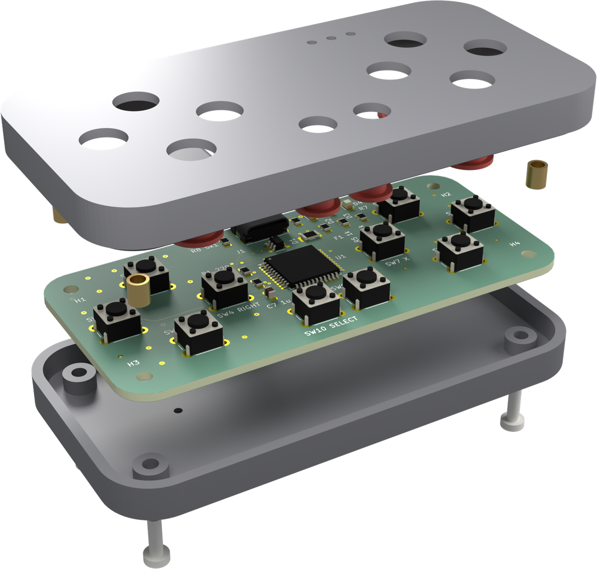

# pcb-design-brief

An agent-ready design brief for **small-series, hand-soldered PCBs** in KiCad with a
**3D-printed enclosure**: rules with IDs, workflow gates, a page-by-page review-PDF specification,
and helper scripts that do the tedious parts.

Hand it to a coding agent together with your project and the agent knows what "done" means:
which questions to ask once at the start, which checks must be green, how the documentation looks,
and how to report where it deviated. The aim is a design that needs hardly any feedback rounds.

## What is in it

| File | Purpose |
|---|---|
| [BRIEF.md](BRIEF.md) | the brief itself (English, normative) |
| [templates/intake.md](templates/intake.md) | the intake questions, project overrides and open assumptions; copy into the project |
| [skills/pcb-design-brief/SKILL.md](skills/pcb-design-brief/SKILL.md) | entry point for agents that load skills (e.g. Claude Code) |
| [docs/sourcing-apis.md](docs/sourcing-apis.md) | distributor, aggregator, fab and CAD-data APIs for prices, stock and specs |
| [pcbtools/](pcbtools/), [scripts/](scripts/) | the tools, see below |
| [docs/automation.md](docs/automation.md) | which steps need the agent, which a tool does |

The brief in one breath: ask once, then work alone; function, robustness and cost first, then perfect
labelling; verified data only; prices and specs from APIs during the design, not after it; big exposed pads and
open vias for the soldering iron; zero ERC/DRC warnings; an enclosure that provably fits and prints; a review PDF
from the exploded product render down to per-supplier parts lists, fab and assembly offers and a firmware prompt.

## Example

[examples/usb-gamepad](examples/usb-gamepad/) is a complete small product built along the brief: a USB-C gamepad
(ATmega32U4, ten buttons, three LEDs) on a hand-soldered 86 × 40 mm board in a printed case. One `build.sh` turns
its design data into schematic, routed board, enclosure, checks, design-to-cost result, renders and the
**[review PDF](examples/usb-gamepad/usb-gamepad-review.pdf)**.

| Product, exploded | Layer stack, to scale |
|---|---|
|  |  |

## Using it with an agent

Pick one:

- **Reference it** from the project's `AGENTS.md` / `CLAUDE.md`:
  `Follow https://github.com/bartfastiel/pcb-design-brief/blob/main/BRIEF.md for all PCB and enclosure work. Our answers: intake.md.`
- **Copy** `BRIEF.md` and `templates/intake.md` into the project and commit them (pins the
  version you agreed on).
- **As a skill** (Claude Code): copy `skills/pcb-design-brief/` into `.claude/skills/` of the
  project or of your home directory, together with `BRIEF.md`.

Then start with: *"Design the board for … following the PCB design brief."* The agent fills
`intake.md`, asks the open questions in one batch and continues on its own.

## Tools

The agent should spend tokens on judgement, not on clicking: it writes the design as data, and `pcbtools` does the
deterministic rest. [docs/automation.md](docs/automation.md) splits the workflow step by step into "agent" and "tool".

```
pip install -r requirements.txt
python -m pcbtools doctor                      # finds KiCad, its Python, Freerouting, Java/Docker, Blender
python -m pcbtools init my-board               # intake.md, design.json, bom-options.json
python -m pcbtools schematic my-board/design.json
python -m pcbtools board my-board/design.json  # place, route, pour, label, untent, ERC/DRC
```

| Command | Rule | What it does |
|---|---|---|
| `doctor` | §3 | every external program and Python package: found where, or how to get it |
| `init` | IN | project skeleton with a minimal circuit that passes ERC |
| `schematic` | §6 | KiCad schematic from `design.json`: library symbols, labelled pin stubs, no-connects, notes; ERC |
| `board` (`place`, `route`, `finish`) | §4, §5, §5a | outline, footprints, net classes, rules, keepouts, pre-routes, fan-out vias, Freerouting with retries, pours with stitching, labels next to their parts, untented vias, DRC with parity |
| `check` | §4 gates | ERC, DRC with schematic parity; non-zero exit on any finding |
| `calc` | CI-1, CI-2 | LED resistors, dividers, crystal load capacitors, IPC-2221 track width, enclosure temperature |
| `parts search` / `offers` / `compare` / `fill` | SO-0, §6a | distributor APIs (keys from the environment): parametric search, offers with packaging and price breaks, cached; part × supplier table |
| `cost` | §6a | design to cost: cheapest consistent BOM for the series, with per-part fees and shipping |
| `render` | §12.1, §12.4 | Blender: exploded product scene or to-scale layer stack, transparent background |
| `layer_images` | §12.5 | one presence-coloured PNG per board layer |
| `assembly_check` | AC-2, AC-4 | pairwise intersection volumes, six views with inward faces in red |
| `printability` | FDM-2 … FDM-8 | overhangs, bridges, islands, thin features, bed contact; PASS/FAIL with a picture per part |
| `tech_drawing` | §12.7 | three views plus isometric with main dimensions |
| `review_pdf` | §12 | the review PDF from `review.json` |
| `joker_fields`, `untent_vias`, `autoroute` | JF, HS-5, §4 | the single board helpers, also usable on hand-made boards |

`design.json` is documented at the top of [pcbtools/design.py](pcbtools/design.py); the gamepad's
[design.json](examples/usb-gamepad/design.json) is a full example. Steps that need `pcbnew` re-run themselves under
KiCad's Python, so one `python` is enough.

## Questions this brief answers on purpose

- *Why spare solder fields?* Prototypes always miss a part. Exposed fields on a 2.54 mm grid turn
  free copper into perfboard, without touching the functional circuit (1 mm clearance).
- *Why open vias?* They are free test points and rework spots on a hand-soldered board.
- *How do agents avoid unprintable shapes?* Rules FDM-1 … FDM-8 give hard limits, and `printability.py` turns
  them into a gate: the agent gets FAIL with layer height and coordinates, the human gets a picture where every
  surface that needs support is red.
- *Why zero warnings?* A warning that is "fine" today hides the one that is not tomorrow. If a
  rule cannot be met, the deviation is reported by ID instead.
- *Why a 30-page PDF for a small board?* Because it replaces the review meeting: every decision,
  every number and its origin, and the order settings are in one place.

## Contributing

Issues and pull requests are welcome, especially rules that saved you a board revision. Keep rules
short, give them an ID, state the reason in one line.

## License

[MIT](LICENSE)
