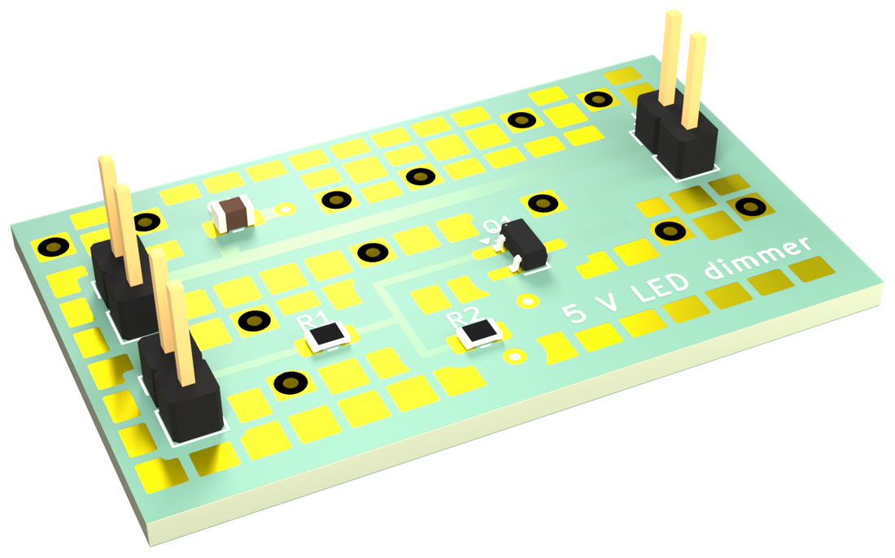
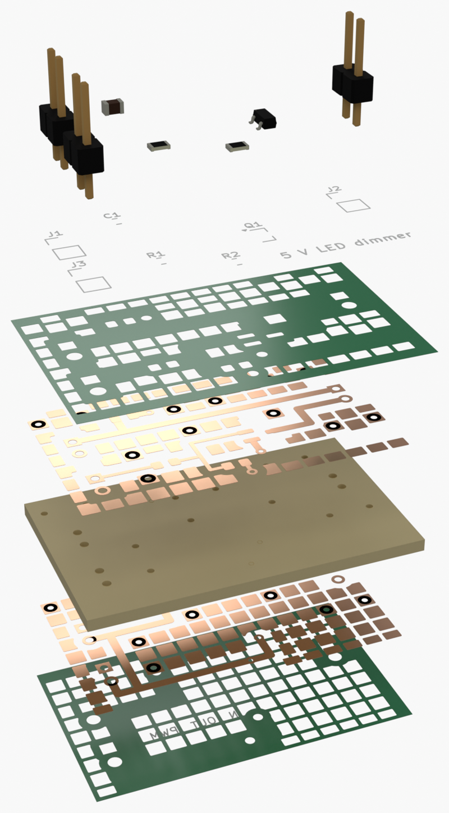
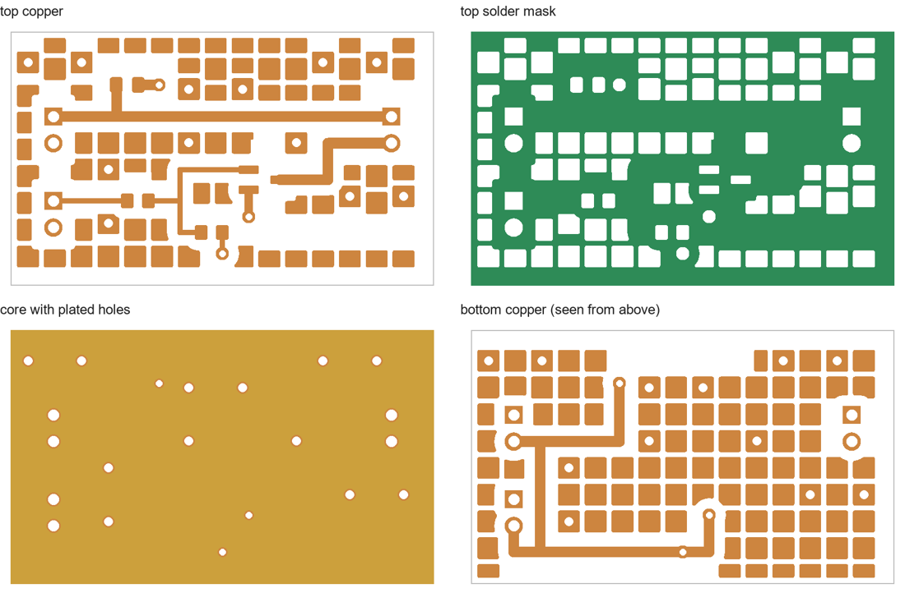
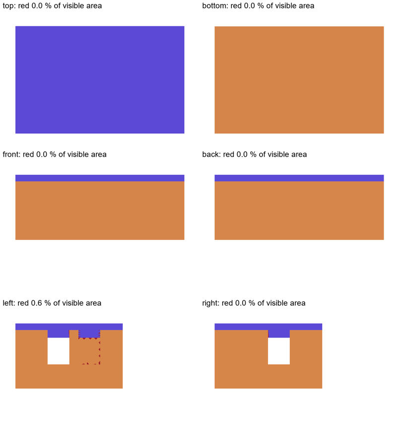
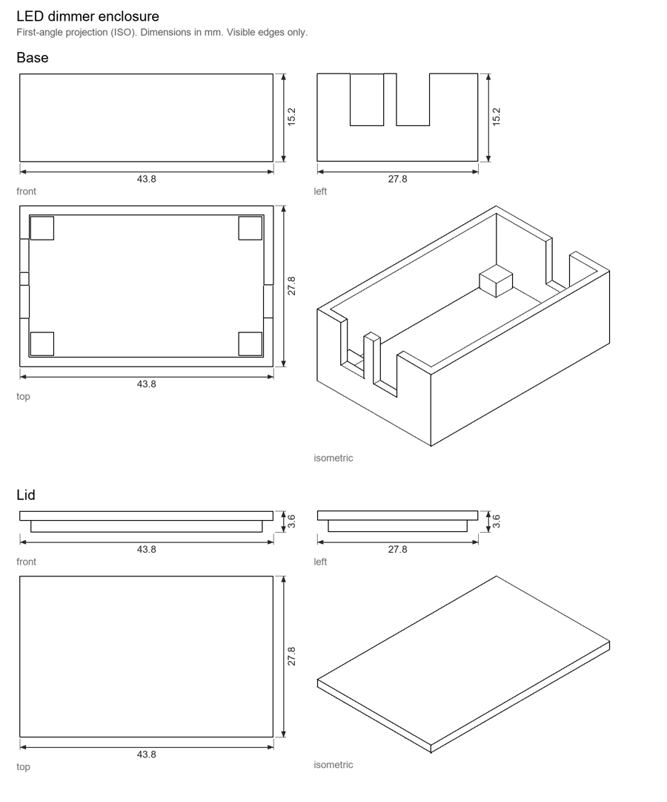

# Example: 5 V LED-strip dimmer

A deliberately small board that shows what the brief asks for and what the scripts produce: a low-side
N-MOSFET switches a 5 V LED strip from a PWM signal. Two layers, 40 × 24 mm, hand-solder footprints, a
two-part printed enclosure.



## 1 Intake

What the user answered (copy of `intake.md`):

| ID | Answer |
|---|---|
| IN-1 Purpose | Dim a 5 V LED strip (≤ 2 A) from a 3.3 V PWM pin of a microcontroller board |
| IN-2 Assembly | by hand |
| IN-3 Series | 5 prototypes |
| IN-4 Budget | 40 € for all five, incl. PCB and shipping |
| IN-5 Suppliers | any large electronics distributor; PCB from a European fab |
| IN-6 Country | Germany, EUR |
| IN-7 Fixed mechanics | none |
| IN-8 Environment | indoor, 0–35 °C |
| IN-9 Tools / browser | may install; browser automation allowed for prices |

Prompt given to the agent:

> Design the board described in `intake.md` following the PCB design brief. Work autonomously and give me the
> review PDF.

## 2 What the agent runs

```sh
# KiCad Python (contains pcbnew); paths are examples
KPY="C:/Program Files/KiCad/10.0/bin/python.exe"
"$KPY" make_board.py "C:/Program Files/KiCad/10.0/share/kicad/footprints" led-dimmer.kicad_pcb
"$KPY" ../../scripts/kicad/untent_vias.py led-dimmer.kicad_pcb          # HS-5
"$KPY" ../../scripts/kicad/joker_fields.py led-dimmer.kicad_pcb         # JF-1 … JF-5
python ../../scripts/kicad/check.py --pcb-only led-dimmer.kicad_pcb     # gate: 0 findings

kicad-cli pcb export glb --user-origin 100x100mm --include-tracks --include-pads \
    --include-silkscreen --include-soldermask -o board.glb led-dimmer.kicad_pcb
python ../../scripts/review/layer_images.py led-dimmer.kicad_pcb layers  # §12.5
blender -b --python ../../scripts/blender/layer_stack.py -- board.glb stack.png --gap 12     # §12.4

python make_enclosure.py enclosure
python ../../scripts/review/assembly_check.py base=enclosure/base.stl lid=enclosure/lid.stl \
    board=enclosure/board.stl -o assembly                                # AC-2, AC-4
python ../../scripts/review/tech_drawing.py Base=enclosure/base.stl Lid=enclosure/lid.stl \
    -o tech-drawing.png                                                  # §12.7
```

`make_board.py` stands in for the agent's own generator script (PR-1); a real project also has a
schematic, and `check.py` then runs ERC and DRC with parity instead of `--pcb-only`.

## 3 Results

**Spare solder fields.** `joker_fields.py` filled the free copper: 12 plated-through fields, 65 on top, 84 on the
bottom, each ≥ 1 mm from every track, pad and hole. DRC still reports 0 findings.

**Layer stack (§12.4)**, every layer to scale, only the gaps are invented:



**Layer details (§12.5)**, presence colours only, nothing from other layers:



**Enclosure check (AC-2, AC-4).** 3 of 3 body pairs without intersection. Inward-facing surfaces are red; they
show only through the connector slots (the two slots in line let you look straight through):



**Technical drawing (§12.7):**



## 4 Deviation report

The brief asks the agent to end with its deviations by rule ID (CO-2). For this example it would read:

| Rule | Deviation | Reason |
|---|---|---|
| HS-6 | PWM and gate tracks run on top, not on the bottom | short, uncrossed tracks; the bottom carries ground |
| §12.1 | no exploded product render | the example has no product around it; see `scripts/blender/exploded_scene.py` |
| CI-4 | no reverse-polarity protection | 2.54 mm headers are keyed by the user's cable only; a P-MOSFET would add 2 parts; user decides |
