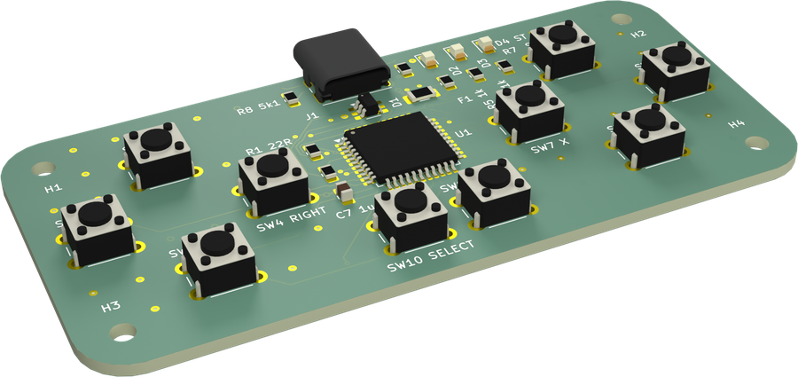
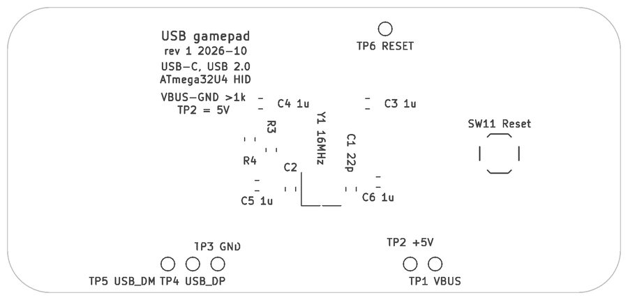
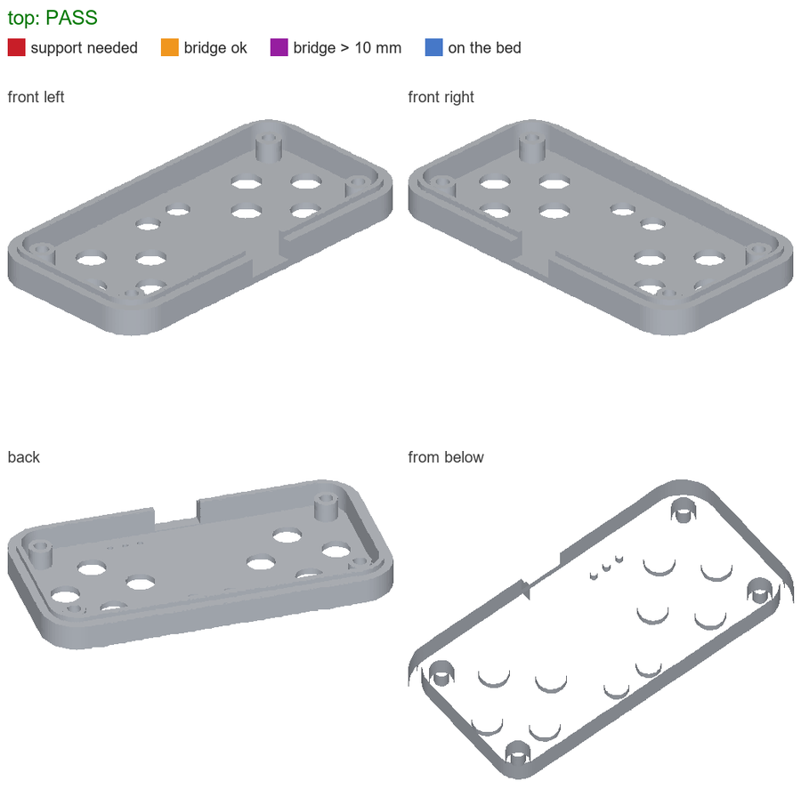

# Example: USB gamepad

A complete small product built along the brief: a USB-C gamepad for PC games with a D-pad, A/B/X/Y, START,
SELECT and three status LEDs, recognised as a standard HID gamepad without a driver. ATmega32U4 with native USB,
hand-soldered two-layer board, 3D-printed case with printed button caps.

**[Review PDF](usb-gamepad-review.pdf)**: everything §12 of the brief asks for, generated by `build.sh`.

Suppliers, fabs, assemblers, links and prices in this example are invented.


## Intake

| ID | Answer |
|---|---|
| IN-1 Purpose | USB gamepad for PC games: D-pad, A/B/X/Y, START, SELECT, three status LEDs, USB-C, no driver |
| IN-2 Assembly | by hand |
| IN-3 Series | 25 devices |
| IN-4 Budget | 450 € for the series, incl. PCB, parts, filament, shipping |
| IN-5 Suppliers | large distributors, a European PCB fab |
| IN-6 Country | Germany, EUR |
| IN-7 Fixed mechanics | none; comfortable button spacing for two thumbs |
| IN-8 Environment | indoor, 0–35 °C, may be dropped |
| IN-9 Tools / browser / APIs | may install; distributor API keys available |
| IN-10 Optimise | cost per series, then size |

## What the build does

```sh
python -m pcbtools doctor     # once: finds KiCad, Freerouting, Java/Docker, Blender
bash build.sh
```

The design is data: [design.json](design.json) lists parts, pins → nets, schematic and board positions, net classes,
the USB-C DRC exception, pre-routes for the receptacle's pin field, keepouts and the bottom title. Everything else is
generated by `pcbtools`:

1. `pcbtools schematic`: KiCad schematic from library symbols, ERC.
2. `pcbtools board`: outline, footprints on both sides, net classes, pre-routes, ground fan-out vias, Freerouting
   (retried until KiCad's DRC finds nothing unconnected), ground pours on both layers with stitching, labels next
   to every part and test point (§5a), untented vias, ERC/DRC/parity 0.
3. `make_enclosure.py` builds base, top and ten caps around the board's 3D export; `pcbtools assembly_check`,
   `printability` and `tech_drawing` prove that it fits, closes and prints.
4. `pcbtools cost` prices the alternatives in [bom-options.json](bom-options.json) (design to cost, §6a); the
   optimised choice is what `design.json` builds.
5. `pcbtools render` (Blender), `make_review.py` collects everything into `review.json`, `pcbtools review_pdf`
   writes the PDF.

## Results

| | |
|---|---|
| Board | 86 × 40 × 1.6 mm, 2 layers, 41 parts, ERC/DRC/parity 0 |
| Case | 93.2 × 47.2 × 13.5 mm, base, top, 10 caps; 21 of 21 body pairs without intersection; printability PASS |
| Design to cost | 4 × 100 nF + 1 µF + 10 µF became 5 × 1 µF, two 10 k became 5.1 k: 3 distinct parts fewer |
| Firmware | a self-contained prompt for a coding agent (Rust) plus flashing over the factory DFU bootloader |

| Board, assembled | Bottom silkscreen (readable side) |
|---|---|
|  |  |

| Layer stack, to scale | Printability of the top shell |
|---|---|
|  |  |

## Deviations reported by the build

The last page of the PDF lists them by rule ID: the 0.8 mm TQFP and the 0.85 mm USB-C pin pitch (HS-2), 0.2 mm
clearance (HS-4), the few values that only fit into the assembly drawing (LB-2), no spare solder fields on a series
product (JF-6).
